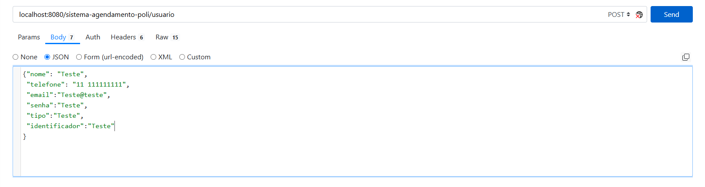
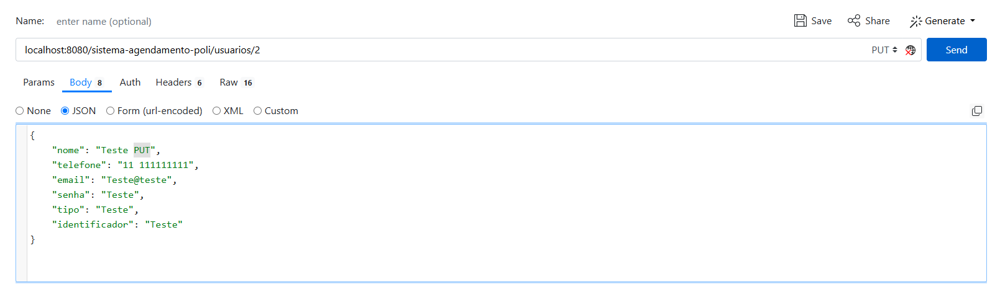

# Sistema de Agendamento Politécnico
## Dependências

O back-end do projeto envolve um banco de dados PostgreSQL conectado ao projeto, acessível por requests HTTP por json.
Para o desenvolvimento deste projeto, foram usados:

* Lombok
* Flyway Migration
* Spring Data JPA
* Spring Boot Devtools
* Spring Boot Validation
* PostgreSQL

### Criando o banco de dados

O funcionamento deste software depende de um banco de dados PostgreSQL com o nome "sistema-agendamento-poli".


## Instruções de uso da API

É possível acessar a API do projeto através do URL `localhost:8080/sistema-agendamento-poli`. Para realizar requests de
classes específicas, é preciso acessar o URL mapeado para a mesma. Os requests podem ser realizados por aplicativos como Postman ou
Insomnia, por exemplo.

Para realizar requests HTTP para os usuários, por exemplo, o URL acessado será `localhost:8080/sistema-agendamento-poli/usuario`.

1. Requests do tipo GET

Todas as classes do projeto possuem a funcionalidade de listar, e de busca por id, mapeados como `/listar` e `/busca/id/{id}`, ou busca por identificador ou e-mail, como no caso dos usuários, mapeados por `/busca/email/{email}` ou `/busca/identificador/{identificador}`.

Exemplo request do tipo GET em `localhost:8080/sistema-agendamento-poli/usuarios/listar` :
```
[{
    "id": 1,
    "nome": "Professor Henry",
    "telefone": "55 999999999",
    "email": "professor@gmail.com",
    "senha": "1234",
    "tipo": "Prof",
    "identificador": "12345678"
}]
```
Requests do tipo GET retornam resultados existentes do banco de dados.

1.1 Funções GET para **visualização de agendamentos**

A classe de Agenda possui alguns mapeamentos especiais para visualizar os agendamentos de um usuário, o calendário de uma sala
em uma data específica, e os agendamentos de uma sala dentro de uma data específica, estes
encontrados em:

`localhost:8080/sistema-agendamento-poli/agendamento/calendario/{salaId}/{data}`, para a visualização de calendário.

`localhost:8080/sistema-agendamento-poli/minhas-reservas/{usuarioId}`, para visualizar as reservas de um usuário.

`localhost:8080/sistema-agendamento-poli/visao-intervalo/{salaId}/{dataInicio}/{dataFim}`, para a visualização dos agendamentos dentro de um intervalo de data.

2. Requests do tipo POST

Os requests POST são responsáveis pela criação de um novo objeto no banco de dados.



É preciso passar por parâmetro, neste caso, um objeto Usuário em JSON.
O resultado em `localhost:8080/sistema-agendamento-poli/usuarios/listar` deverá, então, ser algo similar a:

```
[{
    "id": 1,
    "nome": "Professor Henry",
    "telefone": "55 999999999",
    "email": "professor@gmail.com",
    "senha": "1234",
    "tipo": "Prof",
    "identificador": "12345678"
}, {
    "id": 2,
    "nome": "Teste",
    "telefone": "11 111111111",
    "email": "Teste@Teste",
    "senha": "Teste",
    "tipo": "Teste",
    "identificador": "Teste"
}]
```

3. Requests do tipo PUT

Requests PUT se responsabilizam pela atualização de objetos. Continuando com o exemplo
de usuários, deve ser providenciado o ID do objeto que será modificado, assim como os corpo em JSON.



O resultado será:

```
[{
"id": 2,
    "nome": "Teste PUT",
    "telefone": "11 111111111",
    "email": "Teste@Teste",
    "senha": "Teste",
    "tipo": "Teste",
    "identificador": "Teste"
}]
```

4. Requests do tipo DELETE

Requests DELETE buscam objetos por ID e os removem do banco de dados.
Em `localhost:8080/sistema-agendamento-poli/usuarios/2`, realizando um request tipo DELETE, o
usuário "Teste" será deletado.

Este mkdocs é um work in progress.